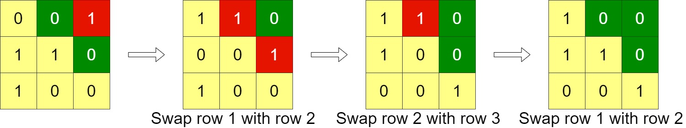
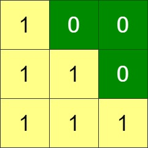

# 1536. Minimum Swaps to Arrange a Binary Grid

Given an `n x n` binary `grid`, in one step you can choose two **adjacent rows** of the grid and swap them.

A grid is said to be **valid** if all the cells above the main diagonal are **zeros**.

Return _the minimum number of steps_ needed to make the grid valid, or **\-1** if the grid cannot be valid.

The main diagonal of a grid is the diagonal that starts at cell `(1, 1)` and ends at cell `(n, n)`.

 

# **Example 1:**

**Input:** grid = \[\[0,0,1\],\[1,1,0\],\[1,0,0\]\]

**Output:** 3

# **Example 2:**

**Input:** grid = \[\[0,1,1,0\],\[0,1,1,0\],\[0,1,1,0\],\[0,1,1,0\]\]

**Output:** -1

**Explanation:** All rows are similar, swaps have no effect on the grid.

# **Example 3:**

**Input:** grid = \[\[1,0,0\],\[1,1,0\],\[1,1,1\]\]

**Output:** 0

 

# **Constraints:**

*   `n == grid.length` `== grid[i].length`
*   `1 <= n <= 200`
*   `grid[i][j]` is either `0` or `1`

 

Hint 1

For each row of the grid calculate the most right 1 in the grid in the array maxRight.

Hint 2

To check if there exist answer, sort maxRight and check if maxRight[i] ≤ i for all possible i's.

Hint 3

If there exist an answer, simulate the swaps.

